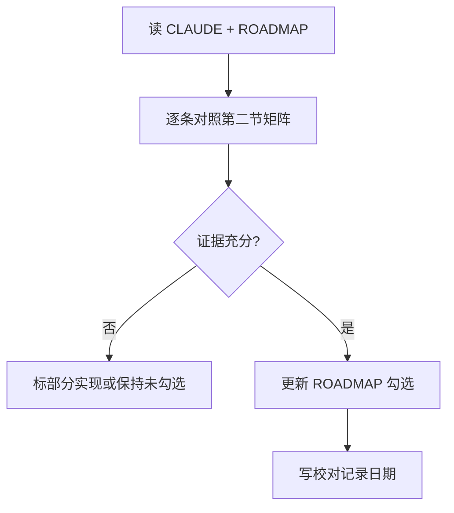

# ROADMAP 校对守则

本文件固化「ROADMAP 完成度」的判定标准，**规范基线以 [`CLAUDE.md`](CLAUDE.md) 为准**。后续每次校对或更新 `ROADMAP.md` 勾选状态时，应遵循本节规则。

---

## 1. 勾选条件（何时可标 `[x]`）

1. **可运行路径**：存在从入口（`langgraph.json` → `src/supervisor_agent/graph.py:graph`）到对应实现的清晰调用链。
2. **契约成立**：输入/输出与 `CLAUDE.md` 或模块内文档一致；失败分支有明确行为（异常、兜底、状态写回）。
3. **可验证**：至少 **1 个主证据**（实现符号）+ **1 个辅助证据**（状态字段、调用链注释、或 `tests/` 中单测）。

若与 `CLAUDE.md` 某条决策**语义冲突**且未达成口径统一，该条目标为 **部分实现**，在 `ROADMAP.md` 或本文件「已知偏差」中注明，**不得**标为完全验收通过（可对主能力标 `[x]` 并附注「口径待统一」）。

---

## 2. 证据类型

| 类型 | 说明 |
|------|------|
| 主证据 | 定义行为的函数/类/图节点（如 `call_model`、`run_planner`、`ExecutorResult`） |
| 辅助证据 | `PlannerSession` 字段更新、`[EXECUTOR_RESULT]` 解析、单元测试断言 |

---

## 3. 版本边界

- **V1**：只根据当前代码勾选 V1 条目；不得因「设计已讨论」提前勾选 V2/V3。
- **V2/V3**：未在代码中出现对应能力（如 Reflection、fan-out）时保持 `[ ]`。

---

## 4. 可追溯性（建议）

每次批量更新 `ROADMAP.md` 勾选时，在 V1 下增加一行 **校对记录**：日期 + 主要证据文件路径（不必逐条重复，可引用本文件第二节矩阵）。

---

## 5. V1 条目 ↔ 代码映射矩阵（2025-04-02）

| ROADMAP V1 条目 | 状态 | 主证据 | 辅助证据 |
|-----------------|------|--------|----------|
| Supervisor ReAct 主循环 | 已实现 | `graph.py`: `call_model`, `dynamic_tools_node`, `route_model_output` | `graph` 编译边 `call_model` ↔ `tools` |
| 三种回复模式 | 已实现（注1） | `graph.py`: `_infer_supervisor_decision`; `call_model` 中 max_replan / Mode3 升级分支 | `state.py`: `SupervisorDecision` |
| 结构化决策 mode/reason/confidence | 已实现（注1） | `graph.py`: `_infer_supervisor_decision` → `SupervisorDecision` | 特殊分支直接构造 `SupervisorDecision` |
| `generate_plan` | 已实现 | `tools.py`: `_build_generate_plan_tool`, `_resolve_planner_input_for_generate_plan` | `planner_agent/graph.py`: `run_planner` |
| `execute_plan` | 已实现 | `tools.py`: `_build_execute_plan_tool` | `executor_agent/graph.py`: `run_executor` |
| Planner：单次调用、意图层 Plan JSON | 已实现 | `planner_agent/graph.py`: `planner_graph` START→`call_planner`→END | `prompts.py`: 禁止工具名；`tools.py`: `_normalize_plan_json` |
| Executor：ReAct、自主选工具 | 已实现 | `executor_agent/graph.py`: `call_executor`↔`tools` 条件边 | `route_executor_output` |
| `ExecutorResult` | 已实现（注2） | `executor_agent/graph.py`: `ExecutorResult`, `_parse_executor_output` | `tools.py`: `[EXECUTOR_RESULT]` 拼接 |
| 失败双重保障 + `_mark_plan_steps_failed` | 已实现 | `tools.py`: `_mark_plan_steps_failed`; `execute_plan` 内 `except` | `test_tools_mark_failed.py` |
| 重规划闭环 MAX_REPLAN | 已实现 | `context.py`: `max_replan`（默认 3） | `graph.py`: `replan_count` 与 `call_model` 上限分支 |
| `dynamic_tools_node` 同步 session | 已实现 | `graph.py`: `generate_plan`/`execute_plan` 分支写 `PlannerSession` | `execute` 时 `updated_plan` 非空才覆盖 plan |
| 基础工具 `write_file` / `run_local_command` | 已实现 | `executor_agent/tools.py`: `write_file`, `run_local_command` | `get_executor_tools()` |
| 基础单元测试 | 已实现 | `tests/unit_tests/supervisor_agent/`, `planner_agent/` | 见下表 |

**注1**：三种模式与 `SupervisorDecision` 主要由 **`_infer_supervisor_decision` 根据本轮 `tool_calls` 推断**，并非要求模型单独输出一段 JSON；另有 **代码分支**（如达最大重规划、Mode2→Mode3 关键词升级）直接写入决策。与「Thought 中显式结构化输出」的严格字面要求若有偏差，以代码为准并在 ROADMAP 校对记录中说明。

**注2**：`updated_plan_json` 内含 `plan_id`/`version` 依赖 **Plan JSON 一贯性**；Executor 侧未单独校验 `version` 字段必存在（解析失败时 `updated_plan_json` 可能为空串）。

---

## 6. 与 CLAUDE.md 的已知偏差（不阻止 V1 勾选，供后续收敛）

- `step_id` 示例类型：文档示例为数值；实现与提示词多为字符串（如 `step_1`）。
- `plan_id` 生成：`planner_agent` 与 `supervisor_agent._normalize_plan_json` 可能存在格式差异，以运行时归一化结果为准。
- **决策 9**：Planner **解析失败**时是否总能写入同一 `plan_id` 的 history——实现以「成功解析出 `new_plan_id`」为更新 Planner 历史的条件；若需与 CLAUDE 完全一致，需单独补全失败路径（见 issue/技术债，非本 ROADMAP V1 逐条）。

---

## 7. 单元测试索引（辅助证据）

| 测试文件 | 覆盖点 |
|----------|--------|
| `tests/unit_tests/supervisor_agent/test_graph_parsing.py` | `[EXECUTOR_RESULT]` 提取、`updated_plan_json` |
| `tests/unit_tests/supervisor_agent/test_tools_mark_failed.py` | `_mark_plan_steps_failed`、`_normalize_plan_json` |
| `tests/unit_tests/supervisor_agent/test_graph_decision.py` | Supervisor 决策推断 |
| `tests/unit_tests/supervisor_agent/test_generate_plan_input.py` | `generate_plan` 首次/重规划输入 |
| `tests/unit_tests/planner_agent/test_build_planner_messages.py` | 重规划消息拼装 |
| `tests/unit_tests/planner_agent/test_graph_extract_plan.py` | Planner 输出 JSON 提取 |

---

## 8. 执行流程（复查用）

