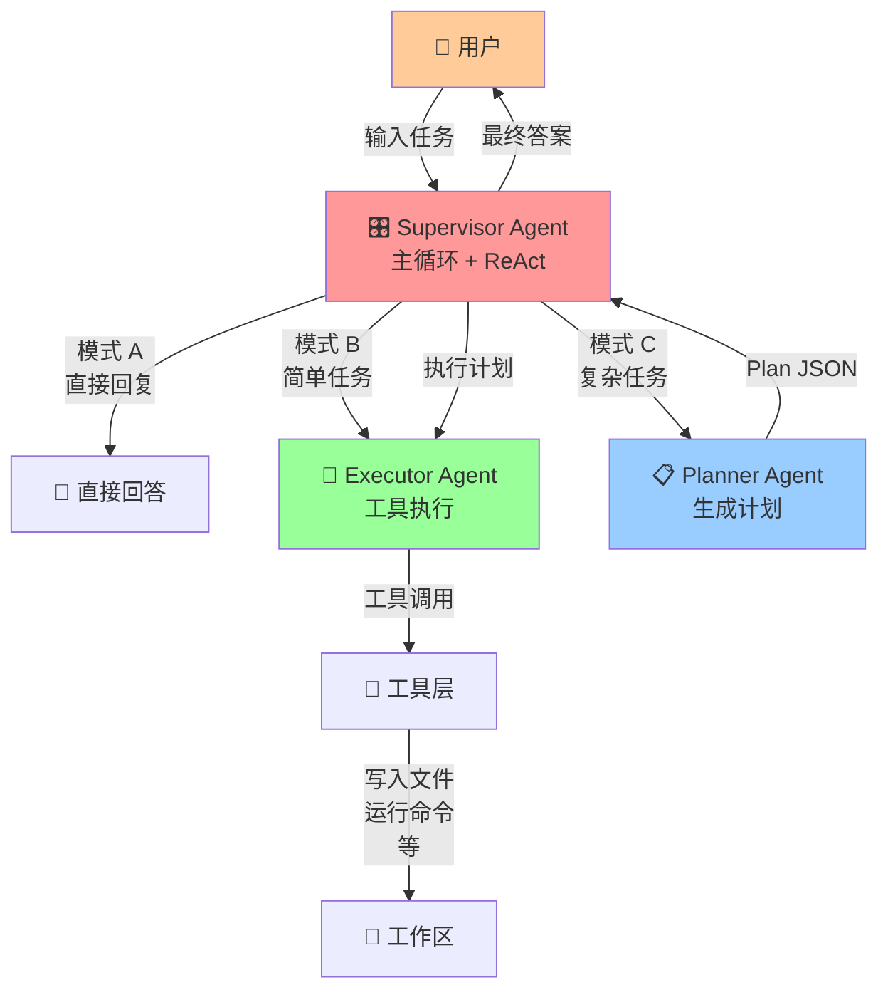
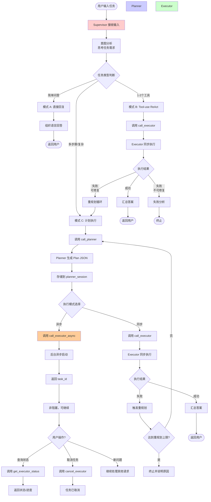
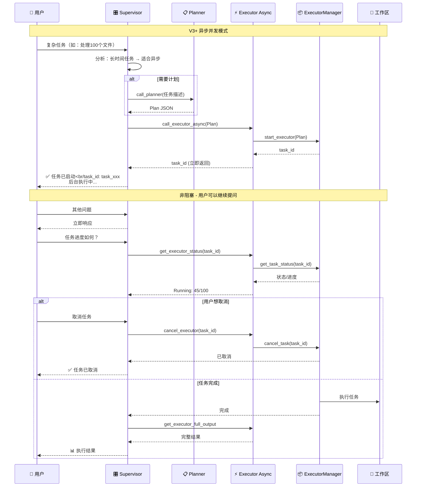
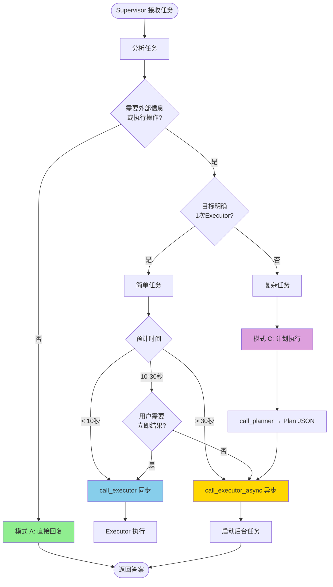
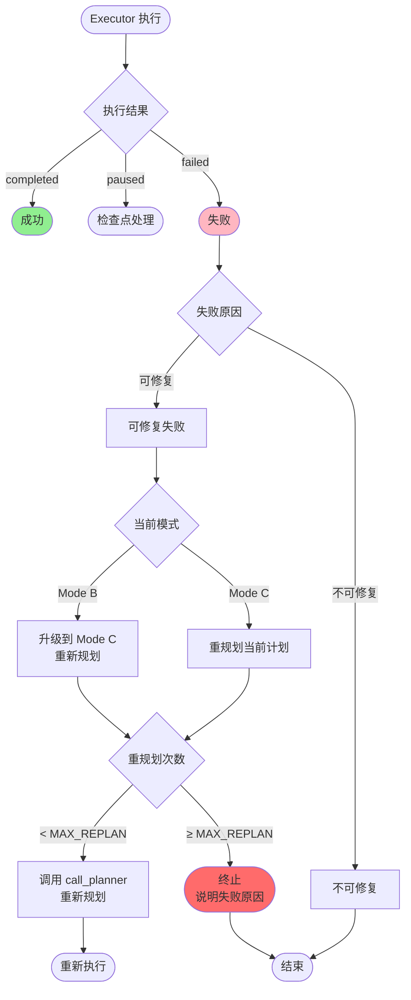
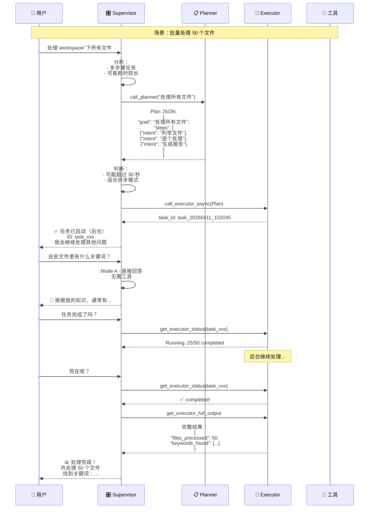
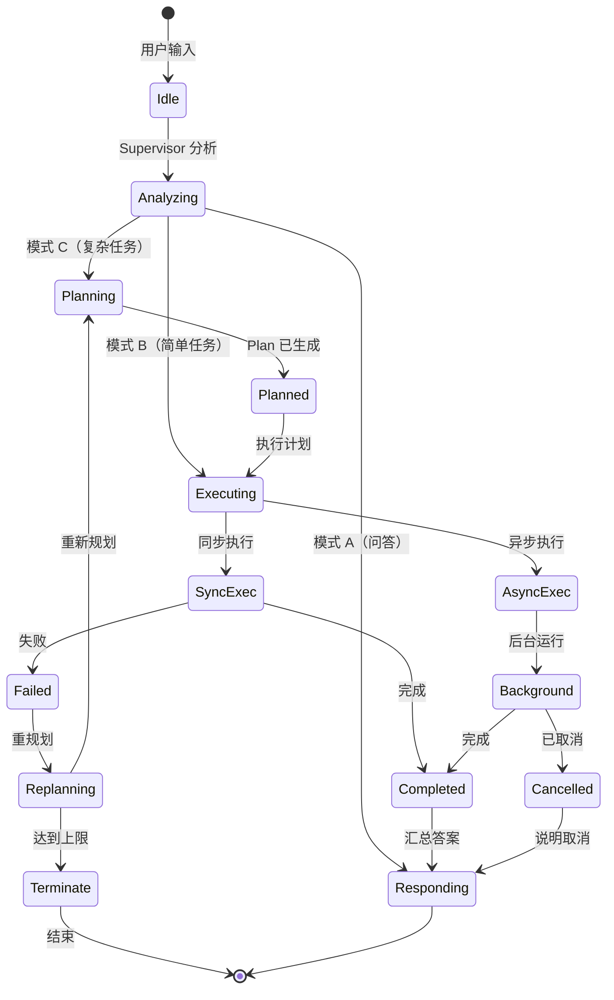
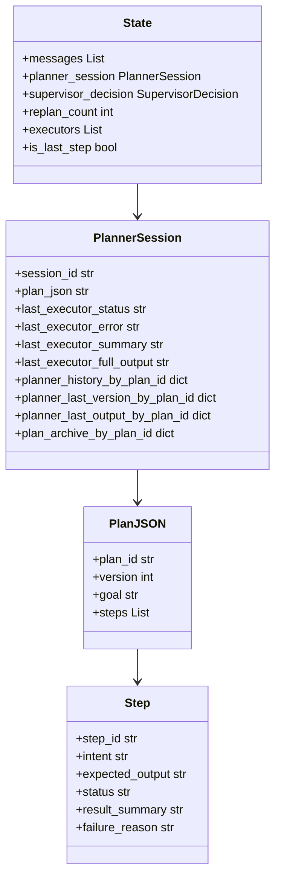
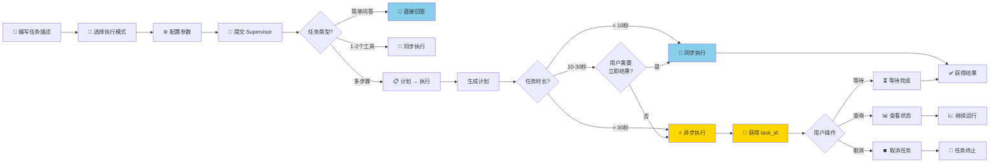

# AgentTriad 完整流程图

## 系统架构总览



---

## 详细执行流程



---

## V3+ 异步并发模式流程



---

## 三种模式决策树



---

## 重规划机制流程



---

## 工具调用完整示例



---

## 状态流转图



---

## 核心数据结构



---

## 使用流程图



---

## 完整工作流总结

### 阶段 1：接收与分析
1. **用户** → **Supervisor**：输入任务
2. **Supervisor** 分析任务意图和复杂度

### 阶段 2：模式选择
| 模式 | 条件 | 行为 |
|------|------|------|
| A | 无需外部信息 | 直接回答 |
| B | 1-2个工具，< 10秒 | 同步调用 Executor |
| C | 多步骤，> 30秒 | 先计划 → 后台异步执行 |

### 阶段 3：执行
**同步执行**：
```
Supervisor → Executor → 工具 → 立即返回结果
```

**异步执行**：
```
Supervisor → call_executor_async → 后台启动
         → 返回 task_id（非阻塞）
用户 → 继续提问 / 查询状态 / 取消任务
```

### 阶段 4：结果返回
- 收集执行结果
- 汇总成最终答案
- 返回给用户

---

**所有流程图均基于实际代码实现！** 📊
