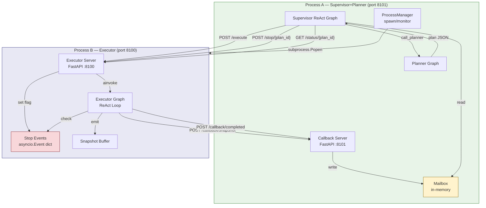
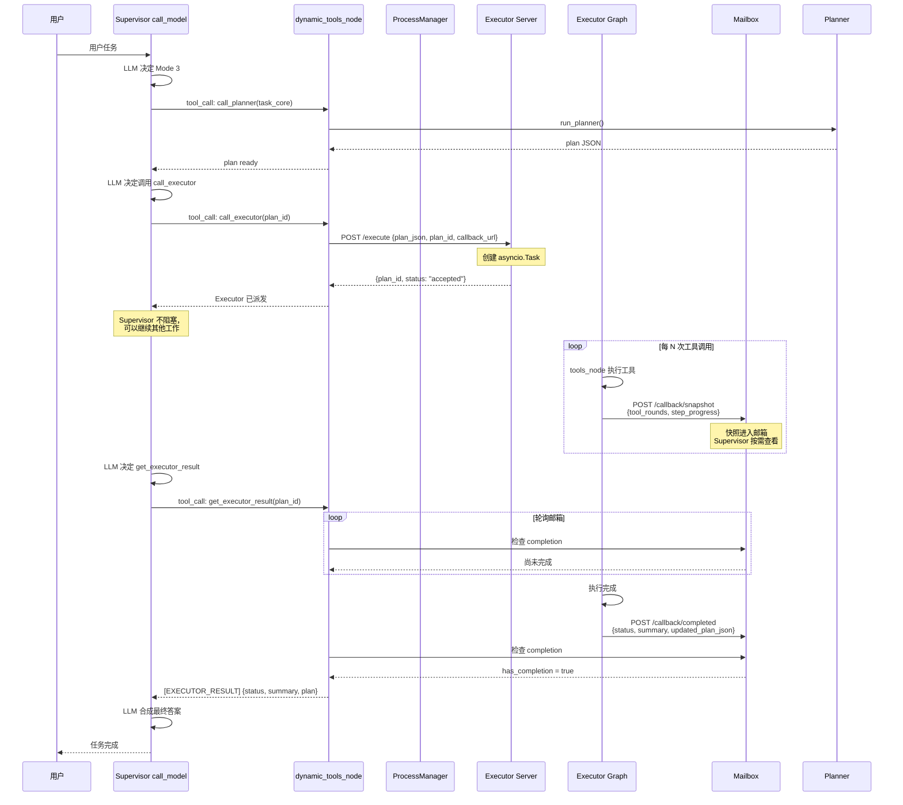
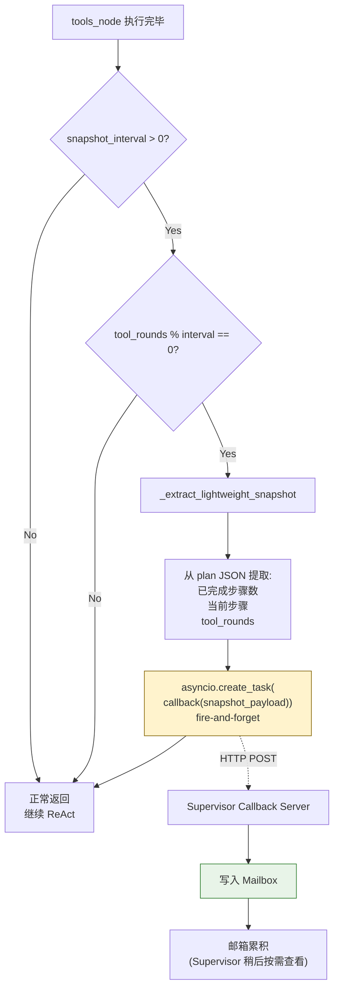
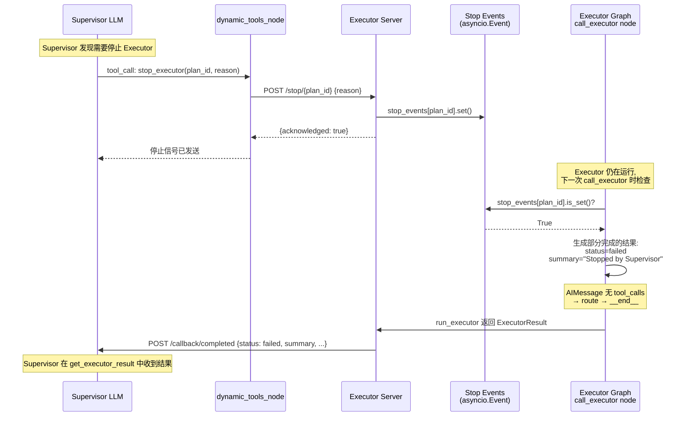
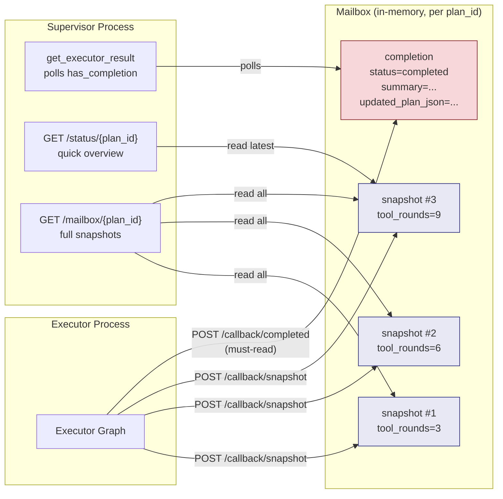
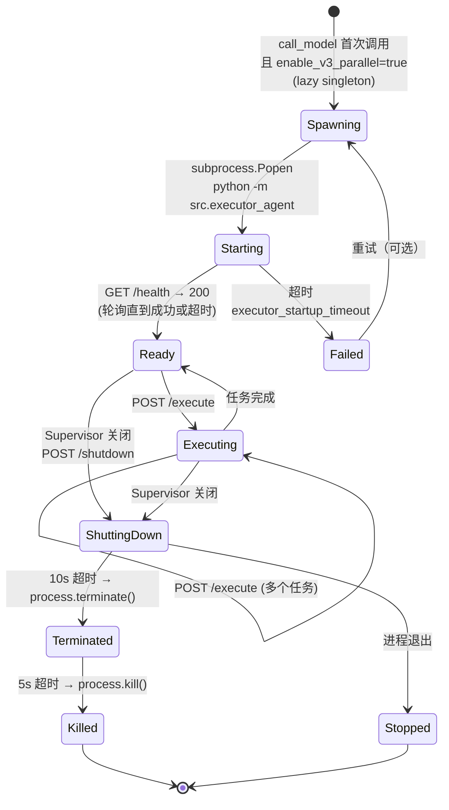
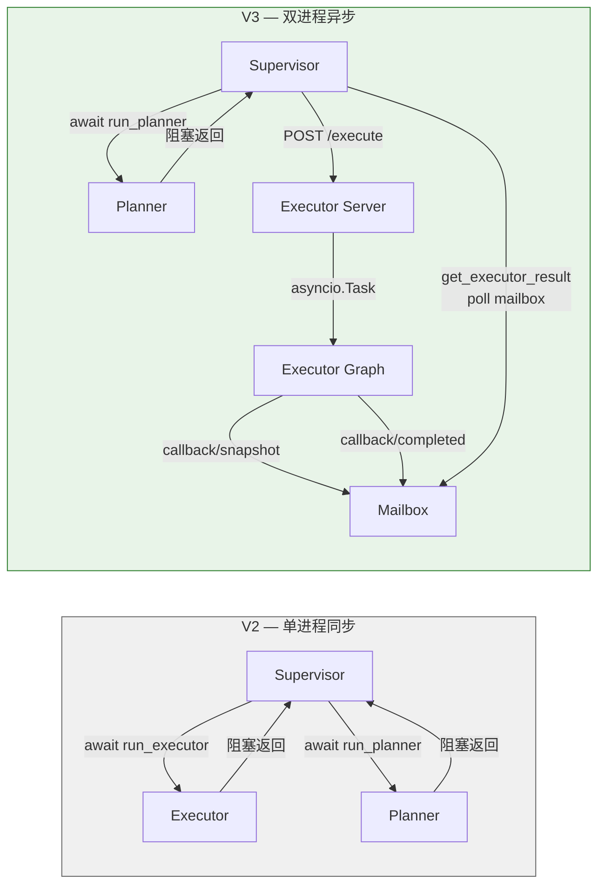
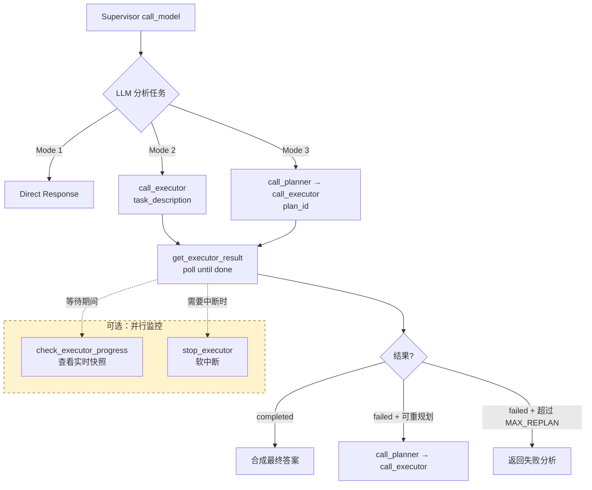
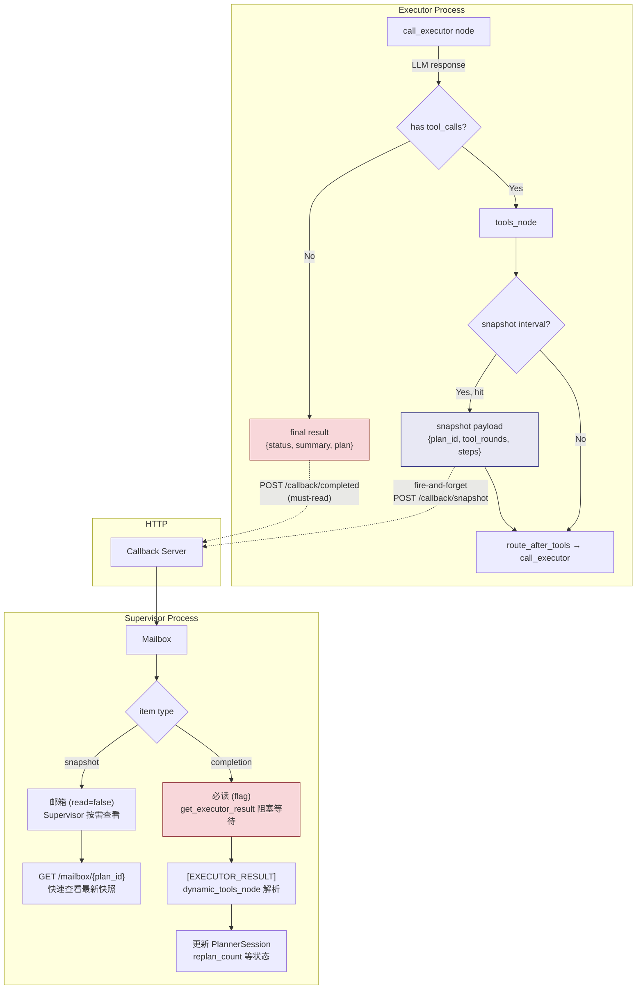

# V3 Architecture — Mermaid Flowcharts

> 用 Mermaid 可视化 V3 进程分离并行架构。工具名以实际代码为准。

---

## 1. 系统架构总览

---

## 2. 完整执行流程（Mode 3 — V3 并行模式）

---

## 3. 快照上报流程（轻量级，不阻塞 ReAct）

---

## 4. 软中断流程

---

## 5. 邮箱模式（Mailbox Pattern）

**关键区分**：
- **蓝色** (snapshot) = 邮箱信息，Supervisor 按需查看
- **红色** (completion) = 必读，`get_executor_result` 阻塞直到收到

---

## 6. 进程生命周期管理

---

## 7. V2 vs V3 对比

**核心区别**：
- V2: `call_executor` **阻塞**等 Executor 完成
- V3: `call_executor` **立即返回**，`get_executor_result` **按需**等待
- V3 可用 `check_executor_progress` 查看实时快照进度
- V3 快照在 ReAct 循环中 **异步上报**，不中断执行
- V3 软中断通过 **asyncio.Event** 实现，Executor **优雅退出**

---

## 8. Supervisor LLM 工具决策树（V3 模式）

---

## 9. 数据流：从 Executor 到 Supervisor

