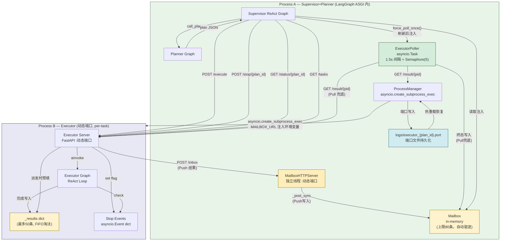
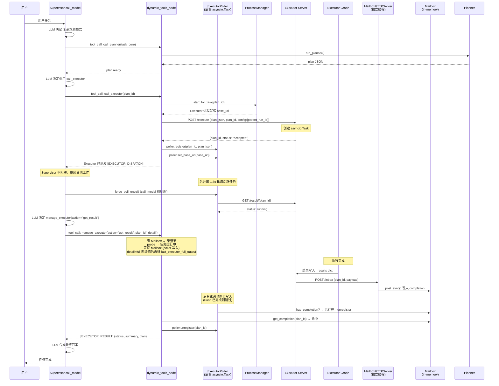
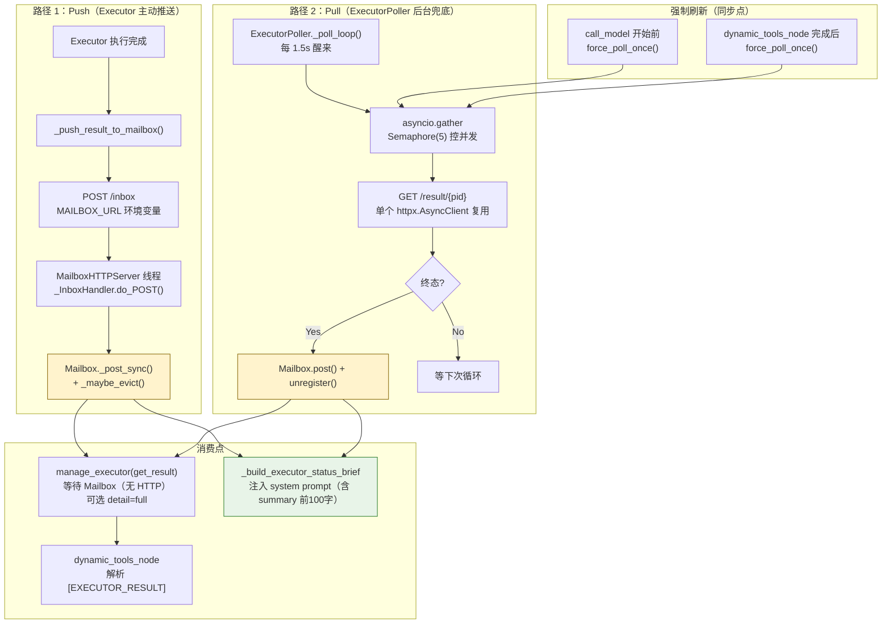
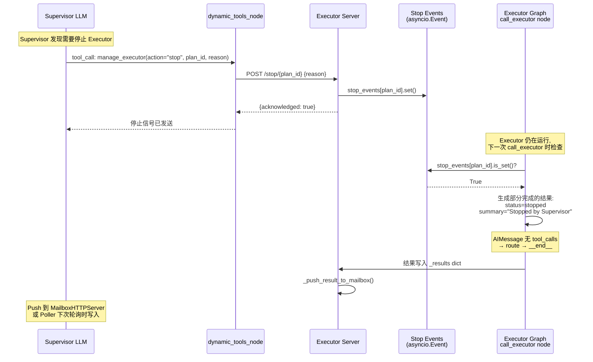
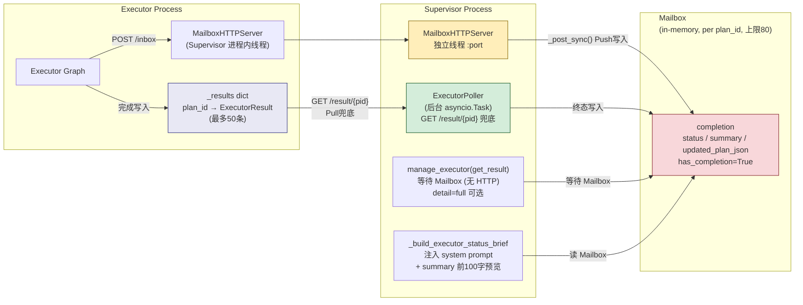
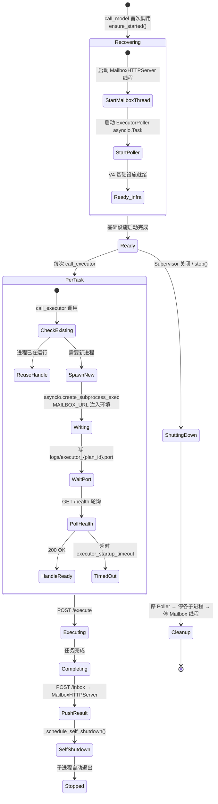
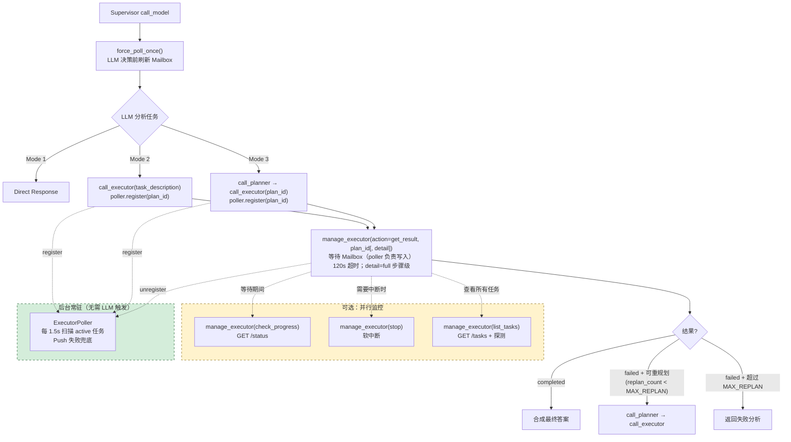
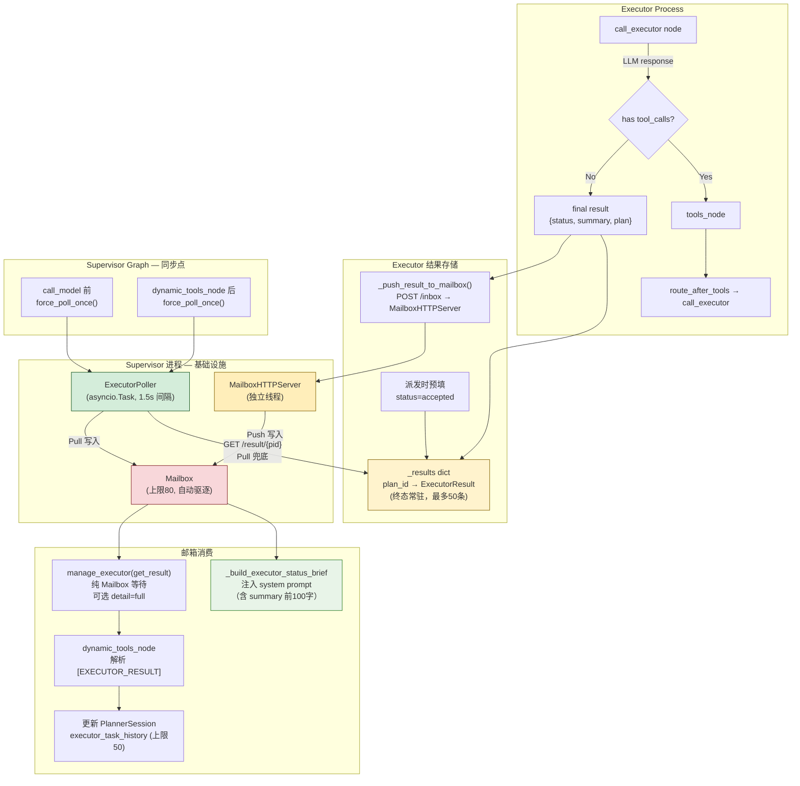

# Architecture — Mermaid Flowcharts

> 用 Mermaid 可视化 进程分离 Push 架构。工具名以实际代码为准。
>
> **核心变化**：
> - **Push 模式**：Executor 主动 POST 结果到 Supervisor 内的 MailboxHTTPServer 线程，不再依赖 Supervisor 主动拉取
> - **统一后台轮询**：`ExecutorPoller`（单一 `asyncio.Task`）替代分散的 `_poll_executor_results`，每 1.5s 用 `asyncio.gather` + `Semaphore(5)` 并发扫描所有活跃任务，共享一个 `httpx.AsyncClient` 连接池
> - **Per-task 进程**：每次 `call_executor` 创建独立 Executor 子进程，完成后自动退出
> - **软中断装饰器**：工具执行期间检查 `stop_event`，可中断长时间运行的命令
> - **Mailbox 内存管理**：写入时自动驱逐已完成的旧 box（上限 80，保留 50）
>
> **设计原则**：
> - Executor 完成后通过 `POST /inbox` 主动推送结果到 MailboxHTTPServer（Push 优先）
> - `ExecutorPoller` 作为兜底：每 1.5s 对 `/result/{pid}` 发起一次拉取，填补 Push 失败的场景
> - `manage_executor(action="get_result")` 工具不再自行轮询 HTTP，只等待 Mailbox（poller 负责写入）；可选 `detail=full` 拉取步骤级详情（见下文第 2 节序列图与第 7 节决策树）
> - `ActiveExecutorTask` 不存 `plan_json`（移至 poller 缓存），Graph State 保持轻量
> - `executor_task_history` 上限 50 条，防止长期运行内存膨胀

---

## 1. 系统架构总览

**与旧架构的关键区别**：
- ❌ 无 Callback Server（不再嵌套 ASGI）
- ❌ 无固定端口（动态分配，避免冲突）
- ❌ 无 `subprocess.Popen`（换 `asyncio.create_subprocess_exec`）
- ❌ 无分散的 `_poll_executor_results`（统一为 `ExecutorPoller` 后台任务）
- ✅ Executor Push 结果到 MailboxHTTPServer，Push 失败时 Poller 兜底拉取
- ✅ `ActiveExecutorTask` 不存 `plan_json`，Graph State 轻量
- ✅ Mailbox 自动驱逐已完成条目，防内存泄漏
- ✅ LangSmith `parent_run_id` 跨进程传递，trace 链路可见

---

## 2. 完整执行流程（并行模式）

---

## 3. 结果写入 Mailbox 的两条路径

**关键原则**：
- Push 是主路径，延迟最低（Executor 完成即通知）
- Pull 是兜底，确保 Push 丢失时（网络异常等）结果也能到达
- `manage_executor(action="get_result")` 纯等待 Mailbox，不自行发 HTTP 请求（`detail=full` 不改变收束路径，仅在终态后附加步骤级正文，或任务已结束时读会话缓存）
- `force_poll_once()` 在 LLM 决策前强制刷新一次，消除信息滞后

---

## 4. 软中断流程

---

## 5. 邮箱模式（Mailbox Pattern）

**关键区分**：
- Executor 完成后通过 `POST /inbox` Push 结果到 MailboxHTTPServer（主路径）
- `ExecutorPoller` 后台拉取 `/result/{pid}` 作为 Pull 兜底
- `manage_executor(action="get_result")` 纯 Mailbox 等待，不主动发 HTTP（120s 超时）；`detail` 见决策 1 与上文「消费点」
- `_build_executor_status_brief` 将 Mailbox 内容（含 summary 摘要）注入 system prompt

---

## 6. 进程生命周期管理

**与旧版的改进**：
- 启动用 `asyncio.create_subprocess_exec`（非阻塞），不再用 `subprocess.Popen`
- 端口动态分配（port=0），每个任务独立端口，不再固定 8100
- Per-task 进程（`logs/executor_{plan_id}.port`），任务完成后进程自动退出
- V4 基础设施启动同时包含 MailboxHTTPServer + ExecutorPoller

---

## 7. Supervisor LLM 工具决策树

---

## 8. 数据流：从 Executor 到 Supervisor

---

## 9. 阻塞风险分析

| 操作 | 阻塞？ | 说明 |
|------|--------|------|
| `asyncio.create_subprocess_exec` | ✅ 不阻塞 | asyncio 原生异步子进程 |
| `process.stdout.readline()` | ✅ 不阻塞 | await，异步读取端口 |
| `httpx.AsyncClient.get/post` | ✅ 不阻塞 | 所有 Executor 通信都是 async HTTP |
| `ExecutorPoller._poll_loop` | ✅ 不阻塞 | 独立 asyncio.Task，Semaphore(5) 限并发 |
| `force_poll_once()` | ✅ 不阻塞 | await gather，短暂等待一轮结果 |
| `manage_executor(action="get_result")` 等待 | ✅ 不阻塞（协程内） | asyncio.sleep(1) 循环，等 Mailbox；`detail=full` 时同循环，终态后附加步骤级文本或读缓存 |
| Mailbox dict 读写 | ✅ 不阻塞 | threading.Lock 内存操作，微秒级 |
| MailboxHTTPServer 写入 | ✅ 不阻塞 | 独立线程，Lock 隔离 asyncio 事件循环 |
| 端口文件读写 | ⚠️ <1ms | 已用 `asyncio.to_thread` 包裹 |
